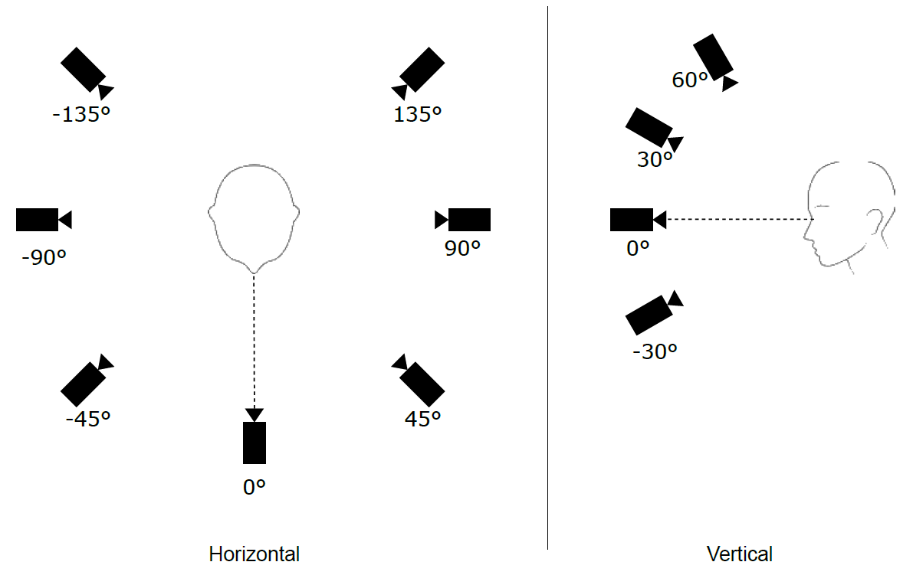
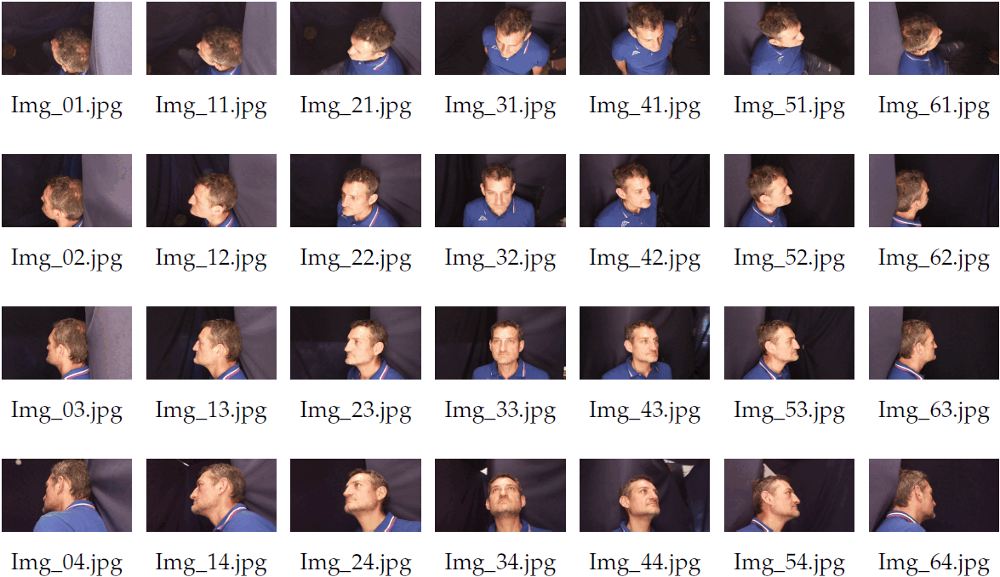

# The Face Recognition from Mugshots Database (FRMDB)

This repository contains the Face Recognition from Mugshots Database (FRMDB), a dataset composed of mugshot images and surveillance videos of 39 subjects. The database can be used for face recognition experiments aiming to evaluate the verification and identification performance in surveillance videos when mugshots from difference Points of View (POVs) are available as reference images.

The FRMDB has been used in the experiments presented in the paper

> P. Contardo, P. Sernani, S. Tomassini, N. Falcionelli, M. Martarelli, P. Castellini, A.F. Dragoni, *The Face Recognition from Mugshots Database: a Dataset to Test the Use of Mugshots from Multiple Points of View for Identification*.

The paper is currently under review for the publication in the [Sensors](https://www.mdpi.com/journal/sensors) journal.

## Data Description

The Face Recognition from Mugshots Database (FRMDB) includes 39 subjects, 17 females and 22 males. The average age is 24.6, with the youngest individual being 19 years old, and the oldest 52 years old. For each subject, the dataset includes:
-  28 mugshots, i.e., 28 color pictures taken from different points of views with the subject posing during the acquisition. The mugshots are 972x544 JPEG images.
-  5 surveillance cameras videos, taken from 5 points of views. In addition, a mosaic video including all the 5 clips at the same time is available. The videos are encoded with the H.264 codec (the container format is Matroska) and recorded at 60 fps. The frame size is 352x288 pixels for the surveillance videos, whereas the size of the mosaic including all the 5 clips is 1280x720 pixels.

The mugshots were collected by taking pictures from 7 angles on the horizontal plane and 4 angles on the vertical plane with four cameras placed on a rotating arm. The following image shows the points of view from which the mugshots were taken

Specifically, on the horizontal plane, the pictures were taken from -135° to +135°, with a step of 45° (with 0° being in front of the subject). On the vertical plane, the pictures were taken from from -30° to +60° (with 0° being the camera on the plane of the subject's eyes) with a 30° step.

The name of the mugshots identifies the point of view of the acquisition. Specifically, for each subject, the mugshot is named “Img_XY.jpg”, where X is an index which represents the angle on the horizontal plane (from 0 = -135° to 6 = +135°. An increment of the index corresponds to +45°) and Y on the vertical plane (from 1 = +60° to 4 = -30°. An increment of the inxed corresponds to -30°). The following image summarizes the naming convention used for the mugshot files.

The videos of each subject are named “yyyy-mm-dd hh-mm-ss-CamX.mkv” using the timestamp corresponding to the start of the video (year-month-day hour-minutes-seconds) and an X index representing the camera which recorded the video (from 1 to 5).

The database is structured as follows.

	 frmdb
	  ├─ original
	  │   ├─ 001
	  │   │   ├─ 001_Mugshots (28 .jpg images)
	  │   │   ├─ 001_Videos
	  │   │   │   ├─ 001_Video1 (6 .mkv videos)
	  │   │   │   └─ 001_Video2 (6 .mkv videos)
	  │   │   ├─ 001_Frames (5 .jpg images)
	  │   │   ├─ 001.jpg
	  │   │   └─ 001.txt
	  │   ├─ 002
	  │   │   ├─ 002_Mugshots (28 .jpg images)
	  │   │   .
	  │   │   .
	  │   │   .
	  │   │   └─ 002.txt
	  │   .
	  │   .
	  │   .
	  │   └─ 039
	  │       ├─ 039_Mugshots (28 .jpg images)
	  │       .
	  │       .
	  │       .
	  │       └─ 039.txt
	  └─ cropped 
	      ├─ mugshots
	      │   ├─ 001 (28 .png images)
	      │   ├─ 002 (28 .png images)
	      │	  .
	      │   .
	      │   .
	      │	  └─ 039 (28 .png images)
	      └─ surveillance
	          ├─ 001 (5 .png images)
	          ├─ 002 (5 .png images)
	       	  .
	          .
	          .
	       	  └─ 039 (5 .png images)

The “[original](frmdb/original)” directory includes the database files as they were collected. It is divided into 39 directories, one for each subject in the database. A subject is identified by a 3 figures code (from “001” to “039”). A subject directory includes:
-  A “XYZ_Mugshots” directory, where XYZ is the subject code. Such directory contains the 28 mugshots of each subject.
-  A “XYZ_Videos” directory, where XYZ is the subject code. Such directory contains
    - A “XYZ_Video1” directory with the 5 videos of the surveillance cameras and their mosaic.
	- Optionally, a “XYZ_Video2” directory with other 5 videos of the surveillance cameras recorded with the subject wearing head accessories such as glasses, sunglasses, hats, and bandanas. Also the mosaic of such videos is included. This set of videos is available for 12 subjects i.e., 001, 005, 006, 007, 012, 013, 016, 017, 018, 019, 029, 030, 034.
-  A “XYZ_Frames” directory, where XYZ is the subject code. Such directory contains 5 frames (.jpg), one for each security camera video. Those frames were used for the test described in the paper.
-  A “XYZ.jpg” file, which is full HD (1920 x 1080) frontal mugshot (.jpg) taken with a different lighting and camera.
-  A “XYZ.txt” text file which includes the subject's sex, age, and the accessories worn in the second set of security videos, if available.

For 3 subjects out of 39 i.e., 011, 013, and 029 a second set of 28 mugshots is available in a XYZ_Mugshots_Smiling directory. Such pictures were taken with the subject smiling.

The “[cropped](frmdb/cropped)” includes the mugshots and the faces from the frames of the surveillance videos manually cropped for the experiments in the paper.
-  “[mugshots](frmdb/cropped/mugshots)” includes a “XYZ” directory for each subject, where XYZ is the subject code. Such directory contains the square of the face cropped in each subject's mugshot. The images are PNG, and the filenames are the same used for the original mugshots.
-  “[surveillance](frmdb/cropped/surveillance)” includes a “XYZ” directory for each subject, where XYZ is the subject code. Such directory contains the faces cropped in each subject's videos, from the frames in the “XYZ_Frames” directory. The images are PNG, and the filenames are “Img_01”, “Img_02”, “Img_03”, “Img_04”, and “Img_05”, identifying the surveillance cameras 1, 2, 3, 4, and 5 respectively.

## Dataset Release Agreement

The dataset is freely released for research and educational purposes.

If you need to provide examples of the dataset in your paper you can use the pictures of subject 031 or subject 032. To publish other pictures from the dataset in your paper, you must ask the permission to the authors.